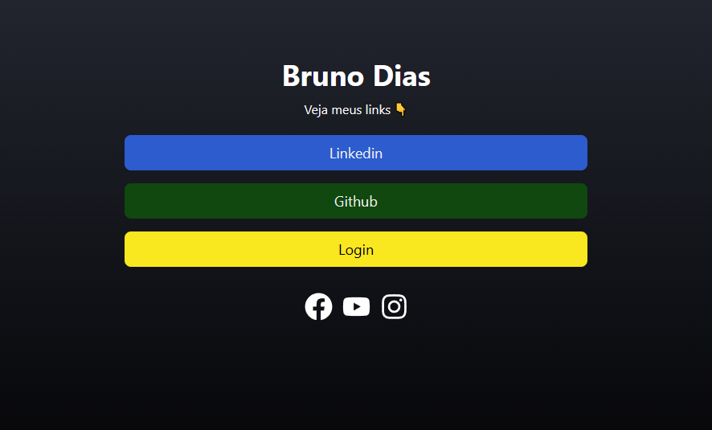
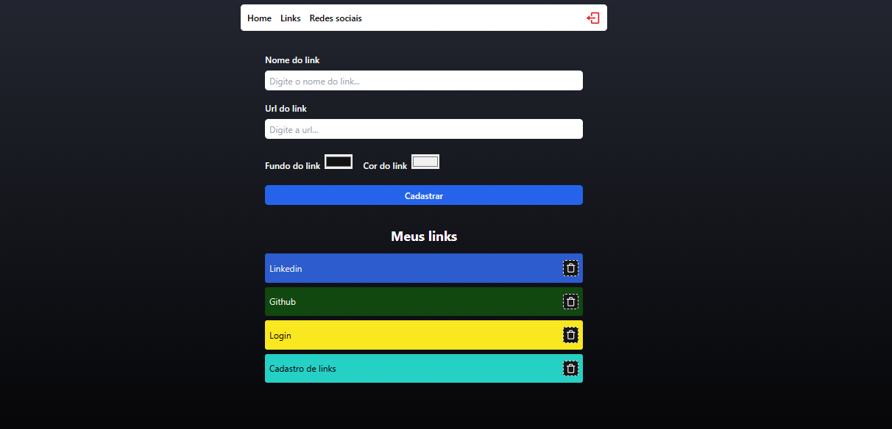
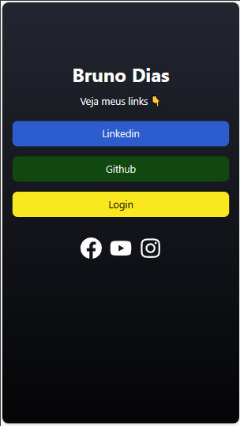
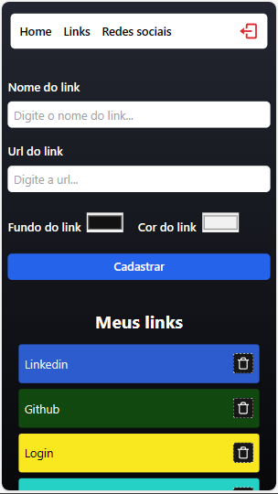

# LinkTree

<hr>

### Tópicos

- [Descrição do projeto](#descrição-do-projeto)

- [Funcionalidades](#funcionalidades)

- [Layout](#layout)

- [Ferramentas utilizadas](#ferramentas-utilizadas)

- [Acesso ao projeto](#acesso-ao-projeto)

- [Abrir e rodar o projeto](#abrir-e-rodar-o-projeto)

- [Desenvolvedor](#desenvolvedor)

## Descrição do projeto

<p align="justify">
 Aplicação desenvolvida para a criação de links personalizados. O email e senha são cadastrados no Firebase, e após sua autenticação, permite que o usuário acesse a página admin, para criar seus links com endereço da url, nome do link, e permite também criar botões podendo navegar por opções de cores para estiliza-los, de forma bem simples, prática e intuitiva.



</p>

## Funcionalidades

:heavy_check_mark: `Funcionalidade 1:` Autenticação do login pelo Firebase e uso do seu banco de dados.

:heavy_check_mark: `Funcionalidade 2:`Login e logout do usuário e proteção de rota.

:heavy_check_mark: `Funcionalidade 3:`Formulário para inserir links e criar botões estilizados, cadastrando no banco de dados.

:heavy_check_mark: `Funcionalidade 4:`Regras de acesso a alterações no banco de dados.

## Layout

<div align="center">





  </div>

###

## Ferramentas utilizadas

<a href="https://react.dev/" style='text-decoration:none' target="_blank">  </a>
<a href="https://www.typescriptlang.org/" style='text-decoration:none' target="_blank">  </a><a href="https://www.javascript.com/" style='text-decoration:none' target="_blank">  </a><a href="https://firebase.google.com/?gad_source=1&gclid=CjwKCAiAxaCvBhBaEiwAvsLmWOwubQQcTr2HdwH94Qk4CgrxK9tD8RB31xQq33PKIcZxsi5lpQYLyBoCkKwQAvD_BwE&gclsrc=aw.ds&hl=pt-br" style='text-decoration:none' target="_blank">  </a><a href="https://html.com/" style='text-decoration:none' target="_blank">  </a><a href="https://git-scm.com/" style='text-decoration:none' target="_blank">  </a>
<a href="https://tailwindcss.com/" style='text-decoration:none' target="_blank">  </a>

- React
- TypeScript
- JavaScript
- Firebase
- HTML
- Git
- TailwindCSS

###

## Acesso ao projeto

Você pode [acessar o site do projeto](https://dinamic-linktree.vercel.app/).

## Abrir e rodar o projeto

```cmd
# Clone este repositório
git clone <link do repositório>

# Acesse a pasta do projeto no seu terminal
cd dinamic_linktree

# Execute a aplicação
npm run dev
```

## Desenvolvedor

[<br><sub>Bruno Dias de Freitas</sub>](https://www.linkedin.com/in/brunodias-dev)
